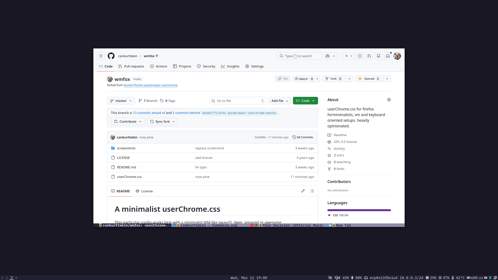

# wmfox: Minimalist Keyboard-Oriented Firefox Theme

wmfox is a custom Firefox theme designed for keyboard-driven, minimalist window manager setups (sway/i3, dwm, xmonad, etc).
This is heavily opinionated and customized for my personal workflow and likings(like fonts, rose-pine colors etc.), check out the Dook97's repo if you want more streamlined solution.

## Features

- **Tabs & URL Bar at the Bottom:** Keeps main content at eye level for a cleaner, distraction-free, ergonomic experience.
- **Numbered Tabs:** Easily switch tabs using `Alt+number` or Vimium's `number+g0`—no guessing, cycling with `Ctrl+Tab`, or reaching for the mouse.
- **Minimal UI:** Optimized for compact mode and removes unnecessary elements for a focused browsing environment.

## Screenshots

## Installation

1. **Enable User Chrome:**
   - Go to `about:config` and set `toolkit.legacyUserProfileCustomizations.stylesheets` to `true`.

2. **Enable Compact Mode:**
   - In `about:config`, set `browser.compactmode.show` to `true`.
   - In the Customize Toolbar menu, set `Density` to `Compact`.

3. **Remove Firefox View:**
   - Use the Customize Toolbar menu to remove the Firefox View icon (top-left corner).

4. **Install the Theme:**
   - Copy `userChrome.css` to the `chrome` directory in your Firefox profile. Create the directory if it doesn't exist.
   - Find your profile directory via `about:profiles`.

5. **Font Configuration:**
   - Install the IBM Plex Mono, or edit `userChrome.css` (search for 'IBM') to use another installed font.

6. **Customize Colors:**
   - Tab text color is determined by its container. Fallback colors are used for non-container tabs.
   - Adjust the color scheme by editing variables at the top of `userChrome.css`.

## Further Customizations

### Disabling Favicons

- Search for 'disable favicons' in `userChrome.css` and uncomment the relevant line.

## Credits

- [Dook97's firefox-qutebrowser-userchrome](https://github.com/Dook97/firefox-qutebrowser-userchrome)
- [aadilayub's firefox-i3wm-theme](https://github.com/aadilayub/firefox-i3wm-theme)
